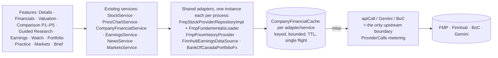

# Financial API cache — Phase 2 implementation (shared financial data cache & request reuse)

Status: committed as "Add financial API cost audit and Phase 2 shared provider cache with request reuse" (on top of `e27991d`). Basis: the Phase 1 audit
(`FINANCIAL_API_AUDIT_SUMMARY.md`, `…_ARCHITECTURE_AUDIT.md`, `…_COST_ANALYSIS.md`, `…_OPTIMIZATION_ROADMAP.md`), re-checked against
the code. No new infrastructure, dependencies, API contracts or app changes; no paid calls.

## 1. Scope and how it maps to the audit

| Change | Audit finding / roadmap item | Done |
|---|---|---|
| Cache core: failures shared with concurrent callers (never stored), cancellation hand-over, expired-first purge, `invalidate`, stats | #7 failure stampede; P1-3; memory control | yes |
| One Finnhub earnings history per symbol (was two keys) | #6 duplicate fetch; P1-1 | yes |
| No retry of 429/402/403 in `EarningsService.retrying` | #7; P1-3 | yes |
| One 24-quarter income request serves Financials (newest 8) and Valuation (was ×8 and ×24) | #6; P1-1 | yes |
| One raw 5-minute-bar fetch shared by the 1D chart and sparklines | #6; P1-1 | yes |
| One Bank of Canada FX instance/cache (was three) | #6; P1-1 | yes |
| Company Details market status from `UsMarketCalendar` (no FMP call) | #8; P1-1 | yes |
| Search results cached by normalized query | P1-4 | yes |
| Upstream metering at the single HTTP boundary (`apiCall`), BoC and both Gemini paths; Gemini tokens for every caller; named cache stats | #10; P0-3 | yes |
| Hourly budget for the public movement narration (template beyond it) | #1 (cost cap part); P0-1 | yes |
| AI usage maps pruned (Brief, Learning, Earnings ask) | memory finding (§4.4) | yes |
| Rate limiting public routes by client | #1; P0-1 | **not done — see §9 (client identity behind Cloud Run)** |
| Lazy per-screen fundamentals bundles; screener warm-up; session/earnings-aware TTLs; stale-while-revalidate | #4, #5, #9; P1-2, P1-5, Phase 3 | deferred to Phase 3 (as in the roadmap) |
| Durable AI quotas for Brief/Earnings; shared cross-instance cache | #2, #3; P0-2, Phase 4 | deferred (owner decisions D1, D2, D4) |

**Correction to the Phase 1 audit**: the Finnhub company-name map (`FinnhubNewsProviderRepositoryImpl.names`) *is* bounded
(`MAX_CACHED_NAMES`); the audit's "unbounded" note was wrong, so nothing was changed there. **New finding**: the server has no
forwarded-headers handling, so behind Cloud Run `remoteHost` is most likely the front-end proxy, not the user — the existing
per-"client" limiters on screener/compare routes probably share one bucket across many users (inferred; verify on a deployment).

## 2. Architecture (unchanged boundaries)

The provider-data caches sit at the lowest shared boundary (the adapter or the one service instance that owns a dataset), so every
feature that reaches the same adapter shares the same entry. No new repository layer was added.

## 3. Cache keys

| Family | Owner (key) | Dimensions in the key | Notes |
|---|---|---|---|
| FMP statements, ratios, estimates, dividends, shares | `FmpFundamentalsLoader` (`endpoint:SYMBOL:period:limit`, plus `success:`/`cooldown:`) | endpoint, exchange-qualified symbol, period (annual/quarter/none), row limit | quarterly income now always `:quarter:24` |
| FMP quote / profile | `FmpStockProviderRepositoryImpl` (`quote:SYM`, `profile:SYM`) | symbol | `StockService` profile layer `SYM` |
| Search | `StockService` (`trim().lowercase()` of the query) | normalized query | results already filtered to US listings |
| Daily closes / intraday points | `PriceChartService` (`daily:SYM`, `intraday:SYM`) | symbol, granularity | split-adjusted by the provider (single policy; no unadjusted series exists in the app) |
| Raw 5-minute bars | `FmpPriceHistoryProvider` (`5min:SYM`) | symbol | shared by chart and sparkline |
| Earnings history | `EarningsService` (`history:SYM:w`) | symbol (window fixed −3 y … +120 d) | `events()` now reads the same entry |
| Earnings calendar | `EarningsService` (`calendar:FROM:TO`) | date window | |
| Company news | `NewsService` (`company:SYM`) | symbol | |
| FX | `BankOfCanadaPortfolioFx` (`FROM:THROUGH`) | date range | one instance |
| Comparison history | `ComparisonHistoryService` (`SYM|period`) | symbol, frequency | tier applied per request, never cached |

Symbols are upper-cased at every route (`[A-Z0-9][A-Z0-9.-]{0,19}`), so `td` and `TD` share a key and `TD` vs `TD.TO` never do. MOCK
vs REAL: one process builds exactly one set of sources (`DataMode`), so the two environments can never share a cache entry; no
environment dimension is needed in keys. Users: no provider-data key contains a uid, and no user-specific value is stored in these
caches (user data lives in Firestore stores; AI answers with user content are per user — see Phase 5 docs).

## 4. Compatibility matrix (who may reuse what)

| Cached data | Reused by | Never reused for |
|---|---|---|
| Annual statement bundle (`F_a`) | Details, Valuation, Screener records, Comparison P1, Comparison history 3Y/5Y, Guided Research, Research summaries/PDF | quarterly views |
| 24-quarter income statements | Valuation (P/E series), Financials quarter (newest 8), Comparison history 1Y (via the quarter bundle) | annual views |
| Quarter balance/cash flow (×8) | Financials quarter, Comparison history 1Y | annual |
| TTM ratios/key metrics (5 min) | Details, Valuation, Comparison, Screener | historical ratios (separate `ratios` annual dataset) |
| Daily closes (split-adjusted) | Charts 1W–ALL, Valuation, Movement, Comparison performance, Portfolio history, Earnings reaction, Practice | intraday |
| Raw 5-min bars | 1D chart, sparklines | daily |
| Quotes | all price displays | — (each keeps its provider timestamp) |
| Profiles | Details, Watch, Comparison, Earnings names, History names | — |
| Earnings history | Earnings details/results/reactions, Watch next earnings, Comparison latest-quarter growth, reminders | — |
| FX (BoC daily) | Portfolio, Practice, Comparison | — (amounts are never converted implicitly; callers apply the dated rate explicitly) |

## 5. Freshness (unchanged values, now centralized where touched)

`FinancialCachePolicy`: `QUOTE` 30 s, `RATIOS` 5 min, `STATEMENTS` 24 h, `TTM_STATEMENTS` 6 h, `ESTIMATES` 6 h, `ACCESS_COOLDOWN` 1 h,
`FAILURE` 30 s, new `SEARCH` 6 h and `INTRADAY` 5 min. Other services keep their existing TTLs (see the audit table). Timestamps are
unchanged: quotes keep the provider's timestamp, statements their `retrievedAt`, earnings their `fetchedAt` and freshness label, so a
cache hit never makes data look newer. Market-session and earnings-aware TTLs and stale-while-revalidate are Phase 3.

## 6. Single flight, failures, cancellation, memory

`CompanyFinancialCache.getOrLoad` (`server/.../service/CompanyFinancialCache.kt`):
- one in-flight `CompletableDeferred` per key; joiners await it; no lock is held while loading, and different keys never wait for each other;
- a failed load completes the in-flight deferred exceptionally (joined callers get the same error), is **not stored**, and the next request
  loads again — no poisoning; callers that want a cooldown cache an outcome value with `resultTtl` (existing `providerCooldown`: 1 h for
  402/403, 10 min for 429, 30 s otherwise);
- if the loading caller is cancelled (client gone, its own timeout), joined callers take over the load instead of failing; no in-flight
  entry remains;
- bounded: on overflow, expired/failed entries are purged first, then least-recently-used entries that aren't loading; `invalidate(key)`
  and `purgeExpired()` are available; the new entry is marked loading before trimming (a bug the new bounds test caught during development);
- waiting is bounded by the callers' existing timeouts (8 s Markets/Watch, 10 s HTTP, 20 s history).

Memory (assumptions, not measured): a daily-close series of ≈ 1,260 rows (≈ 5 years) ≈ 125 KB → 256 entries ≈ 32 MB worst case; FMP
datasets ≈ 2–20 KB each → 512 entries ≈ 1–10 MB; raw 5-min bars ≈ 80 rows ≈ 10 KB → 256 entries ≈ 2.5 MB. Portfolio history holds
references to the same lists as the chart cache (no copy). If FMP's `light` endpoint returns full multi-decade histories for some symbols,
the chart cache could approach ~100–190 MB at capacity; measure `cache.price-chart.*` and heap before raising capacities.

## 7. Instrumentation

- `ProviderCalls.record` (in `httpclient/NetworkUtils.kt`) is the only place that counts **upstream** requests: provider (`fmp`,
  `finnhub`, `boc`, `gemini`), endpoint (path without query — the FMP key is a query parameter and never recorded), feature
  (`ProviderFeature` in the coroutine context, else `other`), outcome (`ok`, `rateLimited`, `denied`, `error`, `timeout`, `invalid`,
  `cancelled`) and `provider.
.latencyMs`. `FmpFundamentalsLoader` no longer records its own `upstream`/`error` (avoids double
  counting); it keeps dataset-level `cacheHit`/`cacheMiss`.
- Gemini: every caller of `GeminiJsonCall` adds `provider.gemini.inputTokens/outputTokens` from the provider's `usageMetadata`.
- Caches with a name emit `cache.<name>.hit|miss|join|expired|evict`: `fmp`, `fmp-intraday`, `profiles`, `search`, `price-chart`,
  `sparklines`, `markets`, `company-news`, `valuation`, `movement`, `watch`, `earnings`, `comparison-history`, `fx`.
- All visible at `GET /internal/metrics/usage` (scheduler token in REAL, open in MOCK). Per instance; aggregate via logs-based metrics
  (Phase 4). `ProviderRequestBudget` is unchanged (comparison history/research).

## 8. Measured before/after (deterministic, REAL adapters on a Ktor MockEngine)

`server/src/test/.../service/ProviderRequestBenchmarkTest.kt` drives the real FMP/Finnhub adapters against a MockEngine that counts
requests (no network). **Before** = the same file run on an untouched `e27991d` worktree; **after** = this working tree. Same instance,
cold caches. These are request counts for the scripted workflows, not production savings.

| Scenario | Before | After | Reduction | What changed |
|---|---|---|---|---|
| One company across features (Details → Financials q → Valuation → Guided Research → 1D chart + sparkline → Earnings details + results → search ×2) | 26 | 20 | −23 % | Finnhub history 2→1, 5-min bars 2→1, income 3→2, search 4→2, market hours 1→0 |
| Four-company comparison (+1Y history, repeat, then AAPL details) | 74 | 72 | −3 % | income 9→8, market hours 1→0 (the 11-dataset bundle per company remains — Phase 3) |
| 50 concurrent identical Company Details | 15 | 14 | −7 % | market hours 1→0 (single flight already held at 1 per dataset) |
| 30 concurrent quotes while the provider returns 503 | 30 | 1 | −97 % | failures shared, not retried by each waiter |

Not measured: BoC (3 → 1 instance is a wiring change; with three features active the same day it removes up to two requests per date
range per 6 h), memory, latency (the mock adds 5 ms per request).

## 9. Remaining limitations

- **Per instance only**: every cache and single flight is per Cloud Run instance; there is no global deduplication. Migration path:
  keep these keys and add an optional L2 (Firestore documents per `endpoint:SYMBOL:period:limit` with a lease) behind
  `CompanyFinancialCache` once D1 (licensing) and D2 (instance counts) are decided.
- **Licensing**: shared reuse of provider data across users within one process is today's behaviour; persistent or cross-instance storage
  still needs confirmation of FMP/Finnhub terms.
- **Public routes**: no per-client rate limiting yet — `remoteHost` is likely the proxy on Cloud Run; needs a trusted client-identity
  decision (forwarded headers from Cloud Run only, App Check, or sign-in for AI explanations — D3).
- Fundamentals bundles still load all datasets for income-only callers; screener warm-up unchanged; TTM ratios refresh every 5 min even
  when closed; profiles have stacked layers (all Phase 3).
- Behaviour change: Company Details market status now uses NYSE calendar rules (it may now show pre-market/after-hours, which the enum
  and apps already support) for every symbol, as the FMP NYSE status did before; MOCK shows the status for its pinned clock.

## 10. Configuration

No new environment variables. Constructor parameters: `CompanyFinancialCache(capacity, now, name, meter)`;
`StockService(searchCache)`; `FmpPriceHistoryProvider(bars)`; `CompanyDetailsService(marketStatus)`; `MovementService(narrationsPerHour = 300)`.

## 11. Tests

- `FinancialCacheTest` (17): hit/miss/expiry/invalidate with a fake clock; result TTLs and distinct keys; bounds (expired first, then
  LRU); 100 concurrent identical requests → 1 load while another key proceeds; failures shared and not stored; loader cancellation
  hand-over and timeout cleanup; Details → Comparison → Guided Research → Financials reuse; annual vs quarterly separation (newest 8);
  TD vs TD.TO; chart + sparkline one intraday request; normalized search; one earnings history; 429 not retried (503 retried once);
  premium history still requires StockSteps+ with shared statements; one upstream count per request and no key in metrics; calendar
  market status; narration budget; MOCK sources have no network adapters.
- `ProviderRequestBenchmarkTest` (1): the before/after table above.
- Full server suite: 384 tests, 0 failures, 3 skipped (`./gradlew :server:test`). No core, Android or iOS code changed, so those builds
  were not re-run for this phase (last results: core JVM 413/0, core iOS 413/0, shared Android 55/0, shared iOS 49/0, APK and iOS
  builds succeeded, earlier today).
