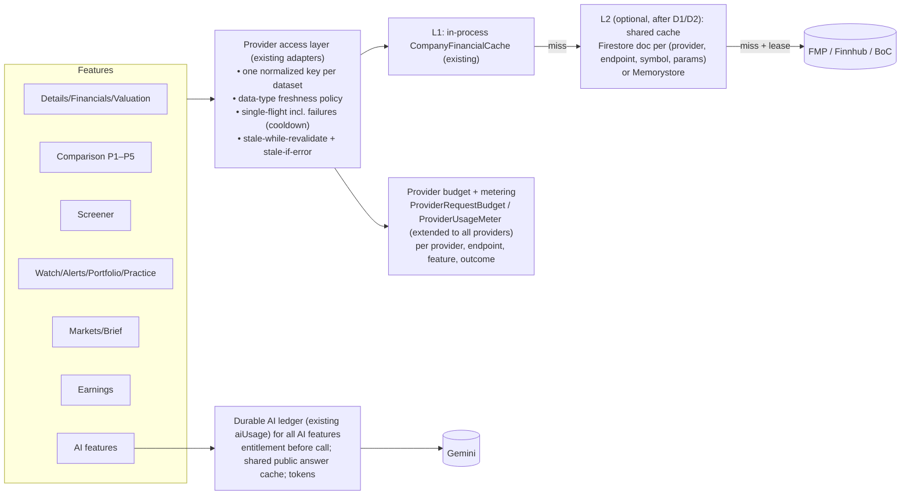

# Financial API optimization roadmap (proposal; nothing here is implemented)

Based on `FINANCIAL_API_ARCHITECTURE_AUDIT.md` and `FINANCIAL_API_COST_ANALYSIS.md`. Proposed TTLs are recommendations, not provider
requirements. Any persistent or cross-user storage of provider data waits for licensing confirmation (decision D1).

## 1. Target architecture

Extend what exists instead of adding services: the shared `FmpStockProviderRepositoryImpl` / `FmpFundamentalsLoader` is already the
de-facto access layer for FMP; `EarningsService` for Finnhub earnings; `NewsService` for Finnhub news; `GeminiJsonCall` for AI.

**Required changes** (Phases 2–4): dataset-level freshness policy; failure-safe single-flight everywhere; remove duplicate fetch paths;
guard public cost-bearing routes; extend metering; durable AI quotas for every Gemini path.
**Optional improvements**: shared L2 cache across instances; batch quote endpoint (if on the plan); session-aware TTLs; stale-while-revalidate.

Distributed coordination options (decide after Phase 4 metrics show the real instance count and hit rates):
| Option | Cost | Complexity | Consistency | Latency | Notes |
|---|---|---|---|---|---|
| Keep per-instance memory (today) | none | none | per instance | best | fine while 1–2 instances serve traffic |
| Cloud Run tuning (min/max instances, higher concurrency) | low | low | fewer, warmer caches | — | **cheapest first lever**; settings outside repo |
| Firestore L2 (doc per dataset, TTL field, lease for single-flight) | per read/write | medium | strong per doc | +10–50 ms | already a dependency; good for statements/profiles (large reuse, slow change); not for 30-s quotes |
| Memorystore (Redis) | fixed monthly instance + VPC connector | medium–high | strong | ~1 ms | justified only at sustained multi-instance load |
| Object storage for long daily histories | low | medium | eventual | higher | only if daily-close payloads become large/hot |
Recommendation: tune instances first; add a Firestore L2 for **statements, profiles, earnings histories and daily closes** only if
metrics show `Instances_eff > 1` matters and licensing allows; do not introduce Redis now.

## 2. Freshness policy (proposed)

| Data type | Existing TTL | Proposed TTL | Session awareness | Stale fallback | Rationale |
|---|---|---|---|---|---|
| Quotes (US/CA) | 30 s repo; 60 s callers; 15 min closed (Markets only) | 30–60 s open; until next open when closed (keep provider timestamp) | yes (`UsMarketCalendar`; add TSX calendar) | last quote, labelled with its timestamp | no new prices when closed |
| Intraday 5-min bars | 5 min ×2 caches | 5 min open, until next open when closed; **one cache** for chart + sparkline | yes | none (plan may deny → 1 h cooldown kept) | duplicate cache |
| Daily closes | 6 h | until the next session close + publication lag (e.g. 18:00 ET), then refresh | yes | last series | today's close becomes available once |
| Profiles | 24 h ×3 layers | 24–72 h, one layer | no | last profile | rarely changes |
| Market cap | via quote | via quote | — | — | already fresh |
| Statements (annual/quarter) | 24 h | 24 h normally; shorter (e.g. 2 h) for 5 days after a symbol's earnings date | earnings-aware | last statements, `retrievedAt` shown | restatements/new filings cluster around reports |
| Ratios/key metrics TTM | **5 min** | 15–30 min open, until next open when closed — or compute price-based ratios from quote + TTM statements | yes | last values | biggest refresh driver after quotes |
| Analyst estimates | 6 h | 12–24 h | no | last | changes slowly |
| Earnings dates (calendar) | 1 h / 12 h past | 1–6 h upcoming, 24 h past | report-day aware | `lastGood` (exists) | |
| Earnings results | 6 h | 15–30 min on report day ± 1 day; 24 h otherwise | yes | `lastGood` | results arrive after the event time |
| News | 10 min / 5 min | keep | — | last feed | |
| FX (BoC) | 6 h ×3 instances | until next BoC publication (~16:30 ET) — one shared instance | yes (business days) | last rate with date | daily series |
| Market status | 60 s provider call | compute from `UsMarketCalendar` (+ TSX) — **no provider call** | yes | — | deterministic |
| AI explanations | per version/digest | keep version keys; add data-version to narration and insight keys where missing | — | — | |

## 3. Prioritized backlog

Format: Priority · Problem · Evidence · Solution · Modules · Benefit · Complexity · Risks · Dependencies · Tests · Acceptance.

### Production blockers / P0
**P0-1 Guard public cost-bearing routes**
- Problem: unauthenticated, un-rate-limited routes trigger FMP, Finnhub and Gemini (article insight, movement narration).
- Evidence: `Application.kt` `stockRoutes`, `newsRoutes`, `newsInsightRoutes`, `movementRoutes`, `marketsRoutes`, `sparklineRoutes`,
  `companyDetailsRoutes`, `watchDataRoutes` — no `RequestRateLimiter`; screener/compare routes already use one.
- Solution: apply the existing `RequestRateLimiter` per client address to all public provider-backed routes; add a per-instance hourly
  budget to `MovementNarrator` (like `ArticleInsightService.hourlyBudget`); consider Firebase App Check or signed-in-only AI
  explanations (decision D3).
- Modules: server routes. Benefit: caps worst-case spend. Complexity: low. Risks: false positives behind NAT (tune limits).
- Tests: route tests for 429 + unaffected normal browsing. Acceptance: no public route can trigger unbounded upstream calls per client.

**P0-2 Durable, cross-instance AI quotas for every Gemini path**
- Problem: Brief, Earnings P5 and article/narration budgets are per instance (N instances → N× allowance); Brief/Learning usage maps grow unbounded.
- Evidence: `DailyBriefService.aiUsage`, `EarningsAiQuotaLedger` (comment says multi-instance needs a shared counter), `LearningService.aiUsage`, `ArticleInsightService` hourly budget.
- Solution: reuse `ComparisonAiQuota` / `UserDataStore.updateAiUsage` with a `feature` per product (earnings, brief); keep global budgets per instance only as a safeguard; prune maps.
- Benefit: real fair-use limits. Complexity: medium. Risks: product decision on shared vs separate allowances (D4).
- Tests: concurrency (parallel requests), multi-feature accounting. Acceptance: quotas hold across simulated instances.

**P0-3 Provider metering everywhere (needed to decide everything else)**
- Problem: only FMP fundamentals, comparison history and comparison AI are metered.
- Evidence: `ProviderUsageMeter` call sites (`FmpFundamentalsLoader.dataset`, `ComparisonHistoryService.input`, `ComparisonAiService`).
- Solution: record `upstream/cacheHit/cacheMiss/error/rateLimited/denied` in `apiCall` (provider + endpoint + `ProviderFeature`), and
  tokens in `GeminiJsonCall.generateWithUsage` for all AI callers; export via logs-based metrics (multi-instance aggregation).
- Benefit: real hit rates, per-feature cost. Complexity: low–medium. Risks: label cardinality (never put symbols/uids in labels).
- Tests: meter unit tests; MOCK route tests asserting counters. Acceptance: `/internal/metrics/usage` shows every provider and feature.

### P1 — Phase 2: shared financial data cache (single instance first)
**P1-1 Remove duplicate fetch paths**
- Finnhub history fetched under two keys (`EarningsService.events` `history:SYM` vs `history` `history:SYM:w`) → one key, one `Window`.
- 5-min bars cached twice (`PriceChartService intraday:SYM` vs `SparklineService`) → sparkline derives from the chart cache.
- Quarterly income fetched twice (limit 8 in `load`, 24 in `quarterlyEarnings`) → fetch 24 once and slice.
- BoC FX: three `BankOfCanadaPortfolioFx` instances and date-range keys → one shared instance, cache the full recent series, slice locally.
- Market status: replace `exchange-market-hours` calls with `UsMarketCalendar` (and a TSX calendar for `.TO`).
- Benefit: removes ~1 Finnhub call per symbol per 6 h, ~1 FMP call per symbol for valuation, one intraday call per symbol per 5 min,
  one FMP call per Details open per minute. Complexity: low. Tests: existing service tests + call-count assertions with fakes.

**P1-2 Lazy, per-screen fundamentals bundles**
- Problem: `getFundamentals` always loads 11 (annual) or 14 (quarter) datasets; comparison history needs only income statements;
  screener records need a subset.
- Evidence: `FmpFundamentalsLoader.load`; `ComparisonHistoryService.fundamentalsOf(symbol, "quarter")`; `ScreenerService.fundamentalsOf`.
- Solution: expose dataset-level accessors (e.g. `incomeStatements(symbol, period, limit)`) on the existing loader; let history and
  screener request only what they use; keep the full bundle for Details/Financials.
- Benefit: comparison history 1Y: 3 → 1 call per company; screener warm-up cost per symbol 11–13 → ~4–6 (exact subset to confirm).
- Complexity: medium. Risks: missed fields in `CompanyRecordBuilder`. Tests: snapshot equality of records/history vs today's output in MOCK.

**P1-3 Failure-safe single-flight**
- Problem: `CompanyFinancialCache` doesn't store failures → queued waiters retry sequentially; `EarningsService.retrying` retries 429s.
- Solution: an outcome-wrapping helper (as `PriceChartService` does) used by the FMP quote/profile keys, earnings windows/histories, BoC
  and comparison history; never retry 429/402/403.
- Tests: concurrent-failure tests asserting one upstream call. Acceptance: N concurrent callers during an outage → 1 upstream attempt per cooldown.

**P1-4 Search cache**
- Problem: 2 FMP calls per debounced query, no cache. Solution: 1–6 h cache on normalized query; prefix reuse optional. Complexity: low.

**P1-5 Screener warm-up budget**
- Problem: up to ≈ 325 FMP/hour/instance during warm-up. Solution: depends on P1-2; then reduce `SCREENER_FUNDAMENTALS_PER_HOUR` or warm
  only on demand; count against `ProviderRequestBudget`. Decision D5.

### P1 — Phase 3: freshness and deduplication
- Session-aware TTLs (quotes, TTM ratios, intraday, daily closes) using `UsMarketCalendar` (+ TSX holidays) — table in §2.
- Earnings-aware statement/result TTLs around report dates (from `EarningsService` history).
- Stale-while-revalidate for statements/profiles/daily closes; stale-if-error everywhere (`lastGood` pattern exists in earnings).
- Single profile layer (remove stacked 24 h caches).
- Tests: clock-driven unit tests across open/closed/holiday/half-day; earnings-day cases. Acceptance: no provider calls for closed-market
  quote/ratio refreshes; no stale value labelled fresh.

### P2 — Phase 4: shared cache, budgets, observability
- Firestore (or Memorystore) L2 for statements/profiles/earnings histories/daily closes with lease-based single-flight — **only after D1
  (licensing) and D2 (instances)**.
- Per-provider budgets (`ProviderRequestBudget` generalized: provider × endpoint class × minute/day) with graceful "temporarily
  unavailable" states; alerts at 70/90 % of plan limits (needs plan numbers).
- Dashboards from logs-based metrics; cost estimates from configured prices (no invented prices).
- Batch quotes if the plan supports them (Watchlist/Portfolio/Markets sectors).
- Retire legacy routes (`/market/snapshot`, `/api/v1/market/gainers|losers`) after confirming no shipped app version uses them (D6).
- Cache `EntitlementService.get` for a few seconds per uid to cut Firestore reads (keep fail-closed).

### Phase 5 — Verification and performance
MOCK integration tests with call-count fakes for every scenario in the cost analysis; concurrency tests (stampede, quotas); load test
against MOCK with N instances; **authorized** REAL acceptance run measuring per-feature upstream counts before/after. Acceptance: measured
reductions match targets; no correctness or freshness regressions; no user data in shared caches.

## 4. Sequence and dependencies
1. **Phase 2a (P0-3 metering + P0-1 route guards)** — small, safe, gives data.
2. **Phase 2b (P1-1 duplicates, P1-3 failure single-flight, P1-4 search cache)** — no infrastructure, no licensing question (same
   in-process scope as today).
3. **Phase 3 (P1-2 lazy bundles, freshness policy, P1-5 warm-up)**.
4. **Phase 4 (P0-2 durable AI quotas if not done earlier, budgets, dashboards, optional L2)** — gated by D1/D2.
5. **Phase 5 verification**.
