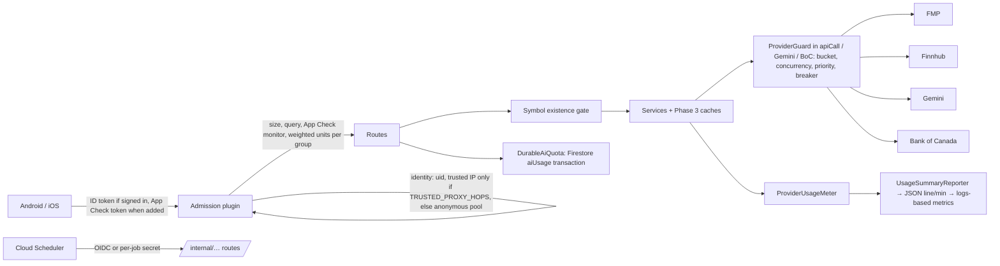

# Financial API — Phase 4 implementation

Date: 2026-10-09. Base: `main` at "Verify financial API Phase 3 with before/after benchmarks and fix earnings-aware statement coverage" (`6a70d0e`);
Phase 4 is committed as "Add financial API Phase 4: public API protection, durable AI quotas, provider budgets and usage monitoring". Design inputs: `FINANCIAL_API_PHASE4_SECURITY_AUDIT.md`, `…_QUOTA_ARCHITECTURE.md`,
`…_COST_MODEL.md`, `…_OBSERVABILITY.md`, `…_DECISIONS.md`, `…_IMPLEMENTATION_PLAN.md` (unchanged). No deployment, no REAL provider calls, no
production data, no paid infrastructure. Every request count below is **measured** with REAL adapters on a Ktor MockEngine unless labelled.

## 1. Executive summary

| Milestone | Status | Main change |
|---|---|---|
| 4A-0 Logging | **PASS** | `logback.xml`: root INFO, `io.ktor`/`io.ktor.client` WARN (provider URLs carrying FMP's key never logged); JSON usage appender |
| 4A Public API | **PASS** (App Check client wiring BLOCKED; trusted-IP hop count needs deployment verification) | identity (`security/ClientIdentity.kt`), cost-weighted admission + size guards (`security/Admission.kt`), App Check monitor/enforce (`security/AppCheck.kt`), per-job/OIDC internal auth (`security/InternalAuth.kt`), symbol existence gate (`service/SymbolExistence.kt`), watch-data cap + bounded concurrency + client chunking |
| 4B Durable AI quotas | **PASS** | `service/AiQuota.kt` (`DurableAiQuota` on `users/{uid}/meta/aiUsage`); Brief AI and Earnings AI (explanation/question/digest) moved off process memory; optional combined cap (disabled) |
| 4C Provider budgets | **PASS** (production values BLOCKED on D4/D5) | `service/ProviderBudget.kt` (`ProviderGuard`): per-provider token bucket, concurrency, priority reserve, circuit breaker; enforced in `apiCall`, both Gemini clients and Bank of Canada |
| 4D Cost monitoring | **PASS** (cloud dashboards/alerts not created — documented) | `service/UsageSummary.kt`: one JSON usage summary per instance per minute; meter gauges (screener coverage) |
| 4E Shared caching | **Deferred** (licensing D3) | §11 future-work note |
| 4F Verification | **PASS** | §9 |

## 2. Files changed

- **New (server main)**: `security/ClientIdentity.kt`, `security/Admission.kt`, `security/AppCheck.kt`, `security/InternalAuth.kt`, `service/SymbolExistence.kt`,
  `service/AiQuota.kt`, `service/ProviderBudget.kt`, `service/UsageSummary.kt`.
- **Changed (server main)**: `resources/logback.xml`; `Application.kt` (wiring); `CompanyFinancialRoutes.kt` (gate); `httpclient/NetworkUtils.kt`
  (budget per attempt, `RequestCost`); `news/GeminiInsights.kt`, `news/GeminiNewsSimplifier.kt`, `userdata/PortfolioMarketService.kt` (budget);
  `screener/ScreenerService.kt` (limiter key, LOW warm-up priority, compare gate, coverage gauges), `screener/ScreenerRoutes.kt`,
  `screener/ComparisonHistoryService.kt`, `brief/DailyBriefRoutes.kt`, `earnings/EarningsService.kt` (identity-keyed limiters, internal auth, NORMAL
  priority for jobs), `brief/DailyBriefService.kt` (durable Brief AI quota), `earnings/EarningsAi.kt` (durable ledger), `earnings/EarningsPremiumService.kt`
  (settle semantics, idempotency key), `earnings/EarningsReminderService.kt`, `userdata/UserRoutes.kt` (watch-data, internal auth),
  `service/ProviderUsage.kt` (snapshot/gauges, internal auth).
- **Changed (KMP core)**: `network/StockStepsApi.kt` (watch-data chunks of 30), `earnings/EarningsPremium.kt` and `brief/DailyBriefModels.kt`
  (optional `idempotencyKey`, additive).
- **Tests (new)**: `service/LoggingSecurityTest.kt` (2), `security/PublicApiProtectionTest.kt` (13), `service/DurableAiQuotaTest.kt` (6),
  `service/ProviderBudgetTest.kt` (10), `service/UsageSummaryTest.kt` (3); core `network/StockStepsApiTest.kt` (+2 compatibility tests). **Changed**: `brief/DailyBriefServiceTest.kt` (+1 cross-instance test),
  `earnings/EarningsPremiumTest.kt` (timeouts now keep their charge — §5), `service/FmpMock.kt`, `service/Phase3AuditBenchmarkTest.kt` (budgeted
  24 h run), `market/MarketSnapshotTest.kt` (thread-safe request list).
- Android and iOS UI code: unchanged (no new screens; new error codes use the existing `ApiError` handling).

## 3. Architecture

- **Admission units** = 1 per request + 1 per upstream FMP/Finnhub/BoC call + 20 per Gemini call **actually made** by that request (`RequestCost`,
  counted where `ProviderCalls.record` runs), so cache hits cost 1. Groups: market data, screener, history, research, earnings, brief, public AI,
  premium AI, user data (`RouteGroup.of`). Denial → 429 `RATE_LIMITED` + `Retry-After`. Per-instance only (N instances ⇒ up to N × limits).
- **Unverified identity** (no verified uid and no configured proxy hops) never uses `remoteHost` or the first XFF value; such callers share a large
  per-instance anonymous pool per group, and existing route limiters skip them instead of throttling every guest together.
- **Provider budget** is the identity-independent backstop: every real upstream attempt (retries included) acquires a permit; denials are
  `StockProviderException(UNAVAILABLE)` with no upstream count, so callers fall back as for an outage (cached/stale data labelled, AI unavailable,
  Practice refuses fills without a fresh quote).

## 4. New configuration (all optional; defaults in brackets)

| Variable | Meaning |
|---|---|
| `TRUSTED_PROXY_HOPS` [unset = don't trust XFF] | 1 for direct Cloud Run ingress, 2 behind an external HTTPS load balancer — **set only after verification** (§8) |
| `ADMISSION_<GROUP>_UNITS_PER_MINUTE`, `_ANONYMOUS_POOL_PER_MINUTE`, `_MAX_IN_FLIGHT` | override `AdmissionPolicy.DEFAULTS` (e.g. market data 400 units/min per identity, 6,000 anonymous pool, 16/256 in flight) |
| `WATCH_DATA_ANONYMOUS_MAX_SYMBOLS` [30] | symbols per watch-data request without a verified uid (signed-in: 100) |
| `FIREBASE_PROJECT_NUMBER`, `APP_CHECK_APP_IDS` [unset] | enable App Check verification (monitor mode) |
| `APP_CHECK_ENFORCE` [false] | reject missing/invalid App Check tokens (startup fails if enabled without a project number) |
| `ALERTS_EVALUATOR_TOKEN`, `EARNINGS_REMINDERS_TOKEN`, `DAILY_BRIEF_DISPATCH_TOKEN`, `USAGE_METRICS_TOKEN` | **one secret per job** (≥ 32 chars; a value reused across jobs disables those jobs). Previously `ALERTS_EVALUATOR_TOKEN` protected all four |
| `INTERNAL_OIDC_AUDIENCE`, `INTERNAL_OIDC_SERVICE_ACCOUNT` | Cloud Scheduler OIDC (preferred over secrets) |
| `PROVIDER_{FMP,FINNHUB,GEMINI,BOC}_PER_MINUTE`, `_BURST`, `_CONCURRENCY`, `_DAILY_TARGET` | plan values for the **whole deployment** |
| `PROVIDER_SAFETY_MARGIN` [0.8], `CLOUD_RUN_MAX_INSTANCES` [1] | local limit = plan × margin ÷ max instances |
| `STOCKSTEPS_PLUS_AI_DAILY_CAP` [unset = disabled] | combined Brief + Earnings AI daily cap (decision D6) |
| `USAGE_SUMMARY_SECONDS` [60; 0 disables] | usage summary interval |

Safety assumptions: without plan values the guard uses finite **development defaults** (FMP 600/min, burst 600, 24 concurrent; Finnhub 60/min;
Gemini 60/min, 4 concurrent; BoC 30/min) and logs "not production-ready"; they are not provider plan limits.

## 5. AI quota semantics (4B)

`DurableAiQuota.reserve` runs a Firestore transaction on `users/{uid}/meta/aiUsage` **after** authentication, StockSteps+ and validation and
**before** any Gemini call. Charges are feature-tagged (`brief-ai`, `earnings-ai-explanation|question|digest`, `comparison-ai`) and each feature keeps its
own retention, so a daily-only feature never prunes Comparison AI's 30-day history. Same idempotency key → same charge (free retry). Release on
failures that produced nothing (provider error, invalid output, coalesced/cached answer). **Timeouts and cancellations keep the charge** (the
provider may have produced a billed result) — this changes the previous "timeouts aren't charged" behaviour (two earnings tests updated). Store
unavailable → 503, no provider call (fail closed). Limits unchanged: Comparison 10/day + 50/30 days; Brief 15/day; Earnings 10/20/3 per day. Global
per-day AI budgets remain per instance (size them as target ÷ max instances). Comparison AI's existing quota class is unchanged.
Anonymous AI (article insight, movement narration, news simplification): admission group `public-ai` (Gemini call = 20 units), the shared Gemini
budget (simplification runs at LOW priority), and the existing per-instance hourly budgets and result caches. No new persistence was added.

## 6. Benchmarks (measured)

| Scenario | Before | After Phase 4 | Notes |
|---|---:|---:|---|
| A Company Details | 17 | 17 | unchanged |
| B Four-company comparison workflow | 72 (pre-Phase 3) / 64 | 64 | unchanged from Phase 3 |
| B′ Cold 1Y history, 4 companies | 56 / 8 | 8 | unchanged |
| D Screener first hour | 328 / 278 | 278 | unchanged |
| D24 Screener 24 h (150 companies) | 1,953 (bug) / 4,353 | 4,353, coverage 150 from hour 6 | unchanged |
| D24 with the 4C development provider budget (warm-up LOW) | — | 4,353, coverage 150 from hour 6, **0 denials** | after two fixes found by this run (burst 600, slot waiting for background work) |
| F Closed-market workflow | 39 / 16 | 16 | unchanged |
| G Earnings workflow | 355 / 253 | 253 | unchanged |
| 1,000 unknown symbols on `/fundamentals` | 13 per symbol (cold bundle) ⇒ ≈ 13,000 (modeled from measured A) | **≤ 2,000** (profile + quote once per symbol), repeats **0** | `PublicApiProtectionTest` |
| Watch-data, anonymous, 100 symbols | up to ≈ 300 upstream in one call, unbounded fan-out | rejected (> 30); ≤ 90 per call, ≤ 8 symbols at once | signed-in keeps 100 |
| 100 calls during a provider 429 storm (Retry-After 20 s) | 100 upstream | **1** upstream, 99 refused locally | `ProviderBudgetTest` |
| 5 instances × 100 calls, plan burst 100, max instances 5 | up to 500 | **100** total | `ProviderBudgetTest` |

Modeled (not measured): with `CLOUD_RUN_MAX_INSTANCES` = N and plan rate R, provider calls are bounded by R × margin regardless of traffic; the
Phase 4 cost model's instance-multiplication table still describes *demand*, which the guard now caps at the configured plan.

## 7. Security and quota test results

All in `:server:test` (§9): random-symbol abuse; watch-data 0/1/30/31/100/101 symbols, duplicates, invalid symbols, partial provider failure;
XFF spoofing (forged leading entries ignored; unverified topology never trusts XFF); anonymous pool vs per-client limits; signed-in exhaustion;
multiple accounts from one IP (each has its own per-instance budget; provider budget bounds the total); App Check missing/invalid/valid in monitor
and enforce modes; internal routes without credentials, with another job's secret, absent without configuration, OIDC accepted/rejected;
oversized body (413), chunked without length (411), long query (414); provider outage (gate UNKNOWN, never negative-cached; stale fallback);
premium bypass (existing route suites); same premium user on two instances; 50 concurrent reservations → exactly the limit; idempotent retry;
Firestore outage (fail closed); timeout/cancellation after reservation (charge kept); UTC day reset; rolling 30-day boundary; restart (new quota
object sees the same count); no provider call after denial; 429 storm; half-open breaker; 5xx isolates one endpoint; 402/403 don't trip; priority
reserve; cancellation releases slots; five-instance sizing; cache hits need no budget; budget exhaustion → labelled stale statements, P/E
unavailable (never zero).

## 8. Remaining production validation and blockers

| Item | Status | What's needed |
|---|---|---|
| Trusted client IP | BLOCKED (D1) | confirm ingress; send a request with a forged `X-Forwarded-For` and check the extracted IP in a debug build/log; then set `TRUSTED_PROXY_HOPS` |
| App Check | BLOCKED | Firebase Console: register apps, Play Integrity (Android) and App Attest/DeviceCheck (iOS); add the App Check SDK to `app/androidApp` and the iOS app; send `X-Firebase-AppCheck` from the shared client; set `FIREBASE_PROJECT_NUMBER`; watch `appcheck.*` in monitor mode; enforce later |
| Provider plan limits and max instances | BLOCKED (D4/D5) | set `PROVIDER_*` and `CLOUD_RUN_MAX_INSTANCES` to the deployed values |
| Scheduler | BLOCKED | Cloud Scheduler jobs with OIDC (or the four new per-job secrets) — existing deployments using one shared secret must be reconfigured or the other three jobs stop |
| Dashboards/alerts/billing budgets | not created (no cloud access) | §10 |
| Gemini project quota | UNKNOWN | provider-side ceiling if available |
| Logging | to verify | confirm the deployed `logback.xml`; if TRACE was ever deployed, rotate the FMP key (§12) |

Backward compatibility: older app builds send > 30 symbols to watch-data for large watchlists and will get `TOO_MANY_SYMBOLS` until updated
(operators can set `WATCH_DATA_ANONYMOUS_MAX_SYMBOLS=100` temporarily); unknown symbols now return 404 `SYMBOL_NOT_FOUND` on fundamentals/details/
valuation/movement (previously 200 with empty data); new codes `PAYLOAD_TOO_LARGE`, `LENGTH_REQUIRED`, `URI_TOO_LONG`, `APP_CHECK_REQUIRED`
(only when enforced), `AI_QUOTA_UNAVAILABLE` use the existing `ApiError` shape and generic client error handling.

## 9. Validation (commands and outcomes, 2026-10-09, final code)

| Command | Outcome |
|---|---|
| `./gradlew :core:jvmTest :core:iosSimulatorArm64Test :server:test :app:shared:testAndroidHostTest :app:shared:iosSimulatorArm64Test :app:androidApp:assembleDebug --continue` | **BUILD SUCCESSFUL in 9 m 1 s** |
| ↳ `:server:test` | **473 passed, 0 failed, 3 skipped** (Firestore emulator tests) |
| ↳ `:core:jvmTest` | **416 passed, 0 failed** |
| ↳ `:core:iosSimulatorArm64Test` | **416 passed, 0 failed** |
| ↳ `:app:shared:testAndroidHostTest` | **55 passed, 0 failed** |
| ↳ `:app:shared:iosSimulatorArm64Test` | **49 passed, 0 failed** |
| ↳ `:app:androidApp:assembleDebug` | up to date (Android sources unchanged since its build at 11:34, which already contained the Phase 4 client change) |
| `xcodebuild -project app/iosApp/iosApp.xcodeproj -scheme app.iosApp -sdk iphonesimulator -destination 'generic/platform=iOS Simulator' CODE_SIGNING_ALLOWED=NO build` | **BUILD SUCCEEDED** |

Total: 1,409 tests, 0 failures. An earlier full run had one failure, `MarketSnapshotTest.fmpQuoteFailureDoesNotRemoveOtherProxyQuotes`
(it passed 3/3 alone): the test collected concurrent MockEngine requests in a non-thread-safe list. Fixed by using a synchronized list (test only).
Not run: REAL providers, production Firestore, Firestore-emulator tests (skipped), device walkthroughs.

### 9a. Provider path audit

Every outbound request in `server/src/main` was traced: only five files make HTTP calls. FMP and Finnhub use `apiCall` (budget per attempt,
retries included); `GeminiJsonCall` (Comparison, Earnings, Brief, article insight, movement narration) and `GeminiNewsSimplifier` (LOW priority)
and `BankOfCanadaPortfolioFx` acquire permits directly; FCM push (`userdata/Push.kt`) is not a paid data provider and isn't budgeted. Tests:
`ProviderBudgetTest.everyUpstreamAttempt…` (apiCall) and `geminiNewsSimplificationAndBankOfCanadaPathsAreGuardedToo` (0 requests sent once
refused).

### 9b. Guests without a trusted client IP

Without `TRUSTED_PROXY_HOPS`, guests share one pool per route group per instance. **Changed during verification**: the pool is charged only for
upstream work (cache hits are free there), so a flood of cheap requests (≈ 100/s was enough before) can no longer lock every guest out
(`PublicApiProtectionTest.unverifiedCallersShareALargePoolThatCheapFloodsCannotExhaust`). Residual risk: the provider budget (≈ 480 FMP calls/min
per instance with development defaults) is lower than the pool (6,000 units/min), so an identity-less abuser causing cold loads can use up the
shared provider budget; others then get cached/stale-labelled data or "temporarily unavailable", never invented values. Signed-in users keep their
own admission limits but share the provider budget. Fix: verified `TRUSTED_PROXY_HOPS`, App Check; optionally set
`ADMISSION_MARKET_DATA_ANONYMOUS_POOL_PER_MINUTE` ≈ 60 % of the per-instance FMP rate.

### 9c. Older app versions

Tested in `core/.../network/StockStepsApiTest.kt`: the current client splits watch-data into chunks of 30 and merges them in order; Phase 4
error codes (`SYMBOL_NOT_FOUND`, `RATE_LIMITED`, `TOO_MANY_SYMBOLS`, `PAYLOAD_TOO_LARGE`) arrive through the existing `ApiError` shape. Older
builds: watchlists over 30 stocks get `TOO_MANY_SYMBOLS` (mitigation `WATCH_DATA_ANONYMOUS_MAX_SYMBOLS=100`); unknown symbols show an error state
instead of an empty page; new optional request fields aren't required; App Check isn't required (monitor mode); timed-out AI requests now count.

### 9d. Production-only blockers (complete list)

1. Deployed logging config check; FMP key rotation if TRACE was deployed. 2. `TRUSTED_PROXY_HOPS` after ingress verification (D1).
3. Cloud Run max instances = `CLOUD_RUN_MAX_INSTANCES` (D4). 4. `PROVIDER_*` plan limits (D5). 5. Cloud Scheduler OIDC or the four per-job
secrets. 6. `WATCH_DATA_ANONYMOUS_MAX_SYMBOLS=100` if older builds are installed. 7. App Check registration + SDKs + `FIREBASE_PROJECT_NUMBER`
(enforcement later). 8. Logs-based metrics, dashboard, alerts, billing budgets (D7). 9. AI policy: combined cap, per-instance AI budgets, Gemini
project quota (D6). Items 1–6 block a public launch. Unknown: provider plan limits/prices, Cloud Run settings, traffic, caching rights (D3).

## 10. Dashboards and alerts (to configure; nothing was created)

Logs-based metrics on `jsonPayload.kind="stocksteps.usage"`: sum `counters[].count` by provider/endpoint/feature/event; events by name (budget
denials, circuit opens, quota denials, admission denials, App Check outcomes, stale served, earnings refreshes, cache hits/misses/joins/evictions);
gauges `screener.coverage.*`. Dashboard panels: FMP requests; Finnhub requests; Gemini calls and tokens; cache efficiency; Cloud Run instances
(built-in); API latency (built-in); rate-limit denials; provider errors; screener coverage; budget exhaustion. Alerts (initial thresholds in
`FINANCIAL_API_PHASE4_OBSERVABILITY.md` §5): provider usage spike, 429 spike, Gemini token spike, unexpected scale-out, coverage < 80 %, AI quota
store errors (`ai.quota.storeError`), log volume, billing budgets at 50/80/100 % — billing alerts notify, they don't cap spending.

## 11. Phase 4E (deferred): shared caching

Needs written FMP/Finnhub approval for multi-user serving and persistent storage (retention), production metrics showing ≥ 2 warm instances most
of the day or usage within ~2× of plan limits, and savings larger than L2 read/write or fixed costs. Candidate design: Firestore (or Cloud
Storage) for statements and profiles with Phase 3 TTLs and earnings signals; never quotes or TTM ratios.

## 12. Operations: logging incident and key rotation

1. Was TRACE deployed? Check the image/commit deployed to Cloud Run (revision → source commit) for `server/src/main/resources/logback.xml` with
   `root level="trace"`; in Cloud Logging, search the service's logs for `financialmodelingprep.com` or `apikey=` (operators only).
2. If yes: create a new FMP key, update the secret (Secret Manager version or the service's env binding), deploy a new revision, verify, then revoke
   the old key at FMP. Never paste keys into tickets or chat.
3. Review who has `roles/logging.viewer` / private log access; set the `_Default` bucket retention deliberately; consider an exclusion filter for
   any residual Ktor DEBUG lines.
4. Validate a clean deployment: request Company Details once and confirm no log line contains `apikey` or provider URLs.

## 13. Rollback

Each mechanism has a switch: unset `TRUSTED_PROXY_HOPS` (identity), raise `ADMISSION_*` values (admission), `WATCH_DATA_ANONYMOUS_MAX_SYMBOLS=100`,
`APP_CHECK_ENFORCE=false`, raise `PROVIDER_*` values (budgets), `USAGE_SUMMARY_SECONDS=0`. The durable AI quotas use the existing `aiUsage` document (no
migration); reverting the commit restores in-memory counters. No data migrations; caches are in memory.

## 14. Readiness

All suites and builds pass (§9). Verdict: **READY WITH CONDITIONS** — not launchable until §9d items 1–6 are configured and verified on the deployment;
App Check enforcement and Phase 4E remain later steps. Shareable summary: https://claude.ai/code/artifact/c4ca8cbb-855c-4aa2-a43a-feecd79b4da9 (private until shared).
