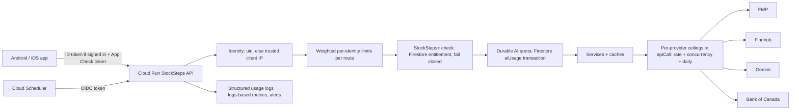

# Financial API — Phase 4 security audit (read-only)

Date: 2026-10-09. Repository: `main` at **"Verify financial API Phase 3 with before/after benchmarks and fix earnings-aware statement coverage"**
(`6a70d0e`), clean working tree. No code, configuration or cloud resources were changed; no REAL provider, Firebase or Firestore calls were made.

Labels: **CONFIRMED** (source inspection or a deterministic test), **MODELED** (calculated from measured inputs and stated assumptions),
**UNKNOWN** (needs deployment configuration, provider terms or production evidence — *owner input required*).
Paths are relative to `server/src/main/kotlin/org/example/stocksteps/` unless stated.

## 1. Deployment facts available in the repository

| Item | Finding | Label |
|---|---|---|
| Dockerfile, Cloud Run service YAML, Terraform, Cloud Build, deploy scripts | **None in the repository** (`scripts/` only holds fixture generators) | UNKNOWN — owner input required |
| Ingress (public `run.app`, external HTTPS load balancer, `--no-allow-unauthenticated`) | not recorded | UNKNOWN |
| min/max instances, concurrency, CPU, memory, timeout | not recorded | UNKNOWN |
| Secrets | read from environment variables (`appconfig/AppConfig.kt`, `System.getenv("FMP_API_KEY")`…); Secret Manager binding not recorded | UNKNOWN |
| MOCK on Cloud Run | refused when `K_SERVICE` is set (`appconfig/DataMode.kt:20`) | CONFIRMED |
| Server plugins | only `StatusPages` (`ApiErrorHandling.kt:12`) and `ContentNegotiation` (`Application.kt:68`); no forwarded-headers, CORS, request-size, App Check or rate-limit plugin | CONFIRMED |
| Logging | `server/src/main/resources/logback.xml`: **root level `trace`** | CONFIRMED |

Because the app routes have no service-level authentication, this audit assumes the Cloud Run service accepts unauthenticated invocations
(the mobile apps call it without Google identity tokens). If the service is deployed `--no-allow-unauthenticated`, the apps could not work as
written — so public invocation is **inferred**, not confirmed.

## 2. Route inventory

Auth: **none** = no token read; **user** = `requireUser` + Firebase ID token (`userdata/UserAuthentication.kt:25`, verified with Google's
certificates, issuer and audience); **secret** = shared header. Limiter = `RequestRateLimiter` (`screener/ScreenerService.kt:416`), a per-instance
sliding minute window keyed by the given string. "Calls/request" are cold-cache upstream requests (Phase 3 benchmark or code reading).

| Route | Method | Auth | Premium | Upstream | Cold calls/request | Cache | Protection | Risk |
|---|---|---|---|---|---|---|---|---|
| `/health`, `/api/v1/meta` | GET | none | — | — | 0 | — | — | low |
| `/api/v1/stocks/search` (`Application.kt:316`) | GET | none | — | FMP ×2 (symbol + name search) | 2 | 6 h, normalised lower-case key | query 1–100 chars | **P1** query variations bypass cache |
| `/api/v1/stocks/{s}/profile`, `/quote` (`:325`, `:340`) | GET | none | — | FMP | 1 | profile 24 h (negative cached), quote 30 s–15 min | symbol regex | P2 |
| `/api/v1/market/gainers`, `/losers`, `/market/snapshot` (`:363`, `:404`) | GET | none | — | FMP | 1–2 | snapshot cache | none | P2 |
| `/api/v1/stocks/{s}/fundamentals` (`CompanyFinancialRoutes.kt:11`) | GET | none | — | FMP | **13** (11 datasets + quote + profile) | 4,096-entry dataset cache, empty results cached 24 h | symbol regex only | **P0** random-symbol cost amplification |
| `/api/v1/stocks/{s}/details` (`Application.kt:560`) | GET | none | — | FMP (+ market data) | ≈ 15–17 | same | regex | **P0** |
| `/api/v1/stocks/{s}/valuation`, `/chart`, `/sparkline`, `/why-moving` | GET | none | — | FMP | 1–4 | chart/valuation caches | regex | P1 |
| `/api/v1/stocks/{s}/news`, `/api/v1/news` (`:370`, `:389`) | GET | none | — | Finnhub (+ **Firestore read per article**, + queued Gemini simplification) | 1 + up to `limit` Firestore reads | feed 10 min | page/limit bounds | **P1** Firestore read amplification; background Gemini |
| `/api/v1/stocks/{s}/news/{id}/insight` (`:604`) | GET | none | — | **Gemini** (+ Finnhub feed) | 1 Gemini | in-memory 7 days per instance | 200 starts/h/instance, 2 concurrent (`news/ArticleInsights.kt:74,132`) | **P1** anonymous AI |
| `/api/v1/stocks/{s}/movement` (`:622`) | GET | none | — | FMP + Finnhub + **Gemini** | 3–6 + 1 Gemini | per-symbol cache | 300 narrations/h/instance (`service/MovementService.kt:75,185`) | **P1** anonymous AI |
| `/api/v1/markets/overview` (`:640`) | GET | none | — | FMP + Finnhub | many on cold | 30 s live / 5 min closed | none | P2 (single cache key) |
| `/api/v1/stocks/watch-data` (`userdata/UserRoutes.kt:64`) | GET | none | — | FMP quote + profile, **Finnhub earnings history per symbol** | up to **3 × 100 symbols = 300** | 60 s quote, 24 h profile, earnings cache | ≤ 100 symbols (`:53`), unbounded `async` fan-out | **P0** |
| `/api/v1/screener/catalog`, `POST /search`, `/compare`, `/compare/performance` (`screener/ScreenerRoutes.kt:28–31`) | GET/POST | none | — | FMP (warm-up is budgeted, 25/h) | compare: ≈ 13 × 4 + Finnhub | dataset cache | 60/min per `remoteHost` (`:18`) | P1 (limiter keyed on proxy, see §4) |
| `/api/v1/compare/history` (`screener/ComparisonHistoryService.kt:173`) | GET | none | 1Y free | FMP | 1 per company | 6 h | 60/min per `remoteHost` | P2 |
| `/api/v1/me/compare/history` (`:176`) | GET | user | 3Y/5Y Plus (checked before provider) | FMP | 1 per company | 6 h | 60/min per uid | low |
| `/api/v1/me/comparison-research/*` incl. `POST /{id}/export` (PDF) | GET/POST/PATCH/DELETE | user | detailed + PDF Plus | FMP (reuses comparison) | 0 after comparison | — | 120/min per uid; `ProviderRequestBudget` | P2 (CPU for PDF) |
| `/api/v1/me/compare/ai/summary`, `/ask`, `/usage` (`screener/ComparisonAiService.kt:685`) | POST/GET | user | Plus | **Gemini** | 1–2 (one regeneration) | public summaries shared | durable Firestore quota 10/day, 50/30 d; global 2,000/day **per instance**; 20/min per uid | P2 |
| `/api/v1/daily-brief/*` (`brief/DailyBriefRoutes.kt:35`) | GET | none | — | Markets cache | 0 extra | edition cache | 120/min per `remoteHost` | P2 |
| `/api/v1/me/daily-brief/{id}/ai/explain`, `/ai/ask` (`:47–48`) | POST | user | Plus | **Gemini** | 1 | — | **in-memory** 15/day per uid (`brief/DailyBriefService.kt:100,371`) | **P1** |
| `/api/v1/earnings/*` public (`earnings/EarningsService.kt:562–577`) | GET | none | — | Finnhub, FMP prices | 1–3 | 1–6 h | 120/min per `remoteHost`; retries ×2 except 429/402/403 (`:348`) | P1 |
| `/api/v1/me/earnings/{s}/ask` (`:581`) | POST | user | Plus | none in REAL (`research = null`, 503) | 0 | — | in-memory 20/day | low (not live) |
| `/api/v1/me/earnings/reports/{id}/ai/explain`, `/ai/ask`, `/digest/latest/ai` (`earnings/EarningsPremiumService.kt:320–324`) | POST | user | Plus | **Gemini** | 1 | — | **in-memory** ledger 10/20/3 per day, global 5,000/day per instance (`earnings/EarningsAi.kt:28`) | **P1** |
| `/api/v1/me/research/{s}/ask` (`learning/LearningService.kt:101`) | POST | user | Plus | none in REAL (`research = null`) | 0 | — | in-memory 20/day | low (not live) |
| `/api/v1/me/*` watchlists, alerts, devices, portfolio, practice, learning, screens, entitlements | various | user | some | quotes for portfolio/practice | small | — | none (uid-scoped) | P2 |
| `PUT /api/v1/me/entitlements/debug` | PUT | user | — | — | 0 | — | 404 outside MOCK (`userdata/PortfolioAnalyticsService.kt:87`); debug records ignored in REAL (`:72`) | low |
| `/internal/alerts/evaluate`, `/internal/earnings-reminders/dispatch`, `/internal/daily-brief/dispatch`, `/internal/metrics/usage` | POST/GET | secret | — | all users' symbols, push | large | — | **one shared secret** `ALERTS_EVALUATOR_TOKEN` (≥ 32 chars) for all four (`Application.kt:248,260,263,287`); route absent when unset | **P1** |

## 3. Findings

| ID | Sev | Finding | Evidence | Label |
|---|---|---|---|---|
| S1 | **P0** | **Provider API key written to logs.** Root logger is `trace`; Ktor client TRACE lines print full request URLs, and FMP's key is a query parameter (`httpclient/NetworkUtils.kt:62` `parameter("apikey", apiKey)`). One benchmark test run's captured stdout contains **114,826** occurrences of `apikey=` (≈ 1.5 KB and 6 log lines per upstream request). On Cloud Run, stdout goes to Cloud Logging, readable by anyone with log access and retained per the bucket policy. Finnhub/Gemini keys travel in headers and were not seen in these lines. | `resources/logback.xml`; `TEST-…Phase3AuditBenchmarkTest.xml` | CONFIRMED (local); production exposure UNKNOWN (depends on whether this config was deployed) |
| S2 | **P0** | **Anonymous cost amplification by random symbols.** Any syntactically valid symbol (`[A-Z0-9][A-Z0-9.-]{0,19}`) triggers the full fundamentals bundle (13 FMP requests) on `/fundamentals` and ≈ 15–17 on `/details`; there is no existence check (profile/search) before the bundle. Empty answers are cached 24 h per key, so every *new* random symbol costs the full bundle. 1,000 random symbols ≈ 13,000–17,000 FMP requests. | `CompanyFinancialRoutes.kt:11`, `Application.kt:560`, `repositoryImpl/FmpFundamentalsLoader.kt` | CONFIRMED (code); request counts MODELED from benchmark A |
| S3 | **P0** | **Watch-data fan-out.** Anonymous `GET /api/v1/stocks/watch-data?symbols=` accepts 100 symbols and starts all lookups at once (quote, profile, earnings history per symbol): up to ≈ 300 upstream requests per call, no limiter, no auth. | `userdata/UserRoutes.kt:25–53,64` | CONFIRMED |
| S4 | **P0** | **No limits on most public provider routes** (stocks, details, fundamentals, valuation, chart, sparkline, news, insight, movement, markets, watch-data). | §2 | CONFIRMED |
| S5 | **P1** | **Limiter identity is the proxy, not the client.** Every `RequestRateLimiter` keys anonymous traffic on `call.request.origin.remoteHost`; no forwarded-header handling is installed, so behind Cloud Run's front end all anonymous users of an instance likely share one bucket (60–120/min): legitimate users throttle each other, while one abuser can't be singled out. Signed-in earnings and brief routes also key on `remoteHost` (`earnings/EarningsService.kt:542`, `brief/DailyBriefRoutes.kt:20,29`). | `screener/ScreenerRoutes.kt:18`, `ComparisonHistoryService.kt:174` | CONFIRMED (code); proxy address on Cloud Run UNKNOWN (verify on a deployment) |
| S6 | **P1** | **Per-instance AI quotas.** Brief AI (15/day), earnings premium ledger (10/20/3 per day + 5,000 global), article insights (200/h), movement narration (300/h), Comparison AI global (2,000/day) are process memory: they reset on restart and multiply with instance count; a user hitting different instances gets N × the allowance. | `brief/DailyBriefService.kt:100`, `earnings/EarningsAi.kt:28`, `news/ArticleInsights.kt:74`, `service/MovementService.kt:75`, `screener/ComparisonAiService.kt:278` | CONFIRMED (code); multiplication MODELED |
| S7 | **P1** | **Anonymous Gemini routes** (article insight, movement narration, background news simplification) are bounded only per instance per hour. Article insight results are cached per instance (7 days) — other instances regenerate. | `news/ArticleInsights.kt`, `news/NewsSimplificationService.kt` (one worker, queue 20, ≤ 5 queued per response, Firestore claim prevents cross-instance duplicates) | CONFIRMED |
| S8 | **P1** | **One shared scheduler secret** for four internal routes (alerts, reminders, brief dispatch, usage metrics); compared with `!=` (not constant-time); a leak of the metrics token also allows triggering push dispatch. No Cloud Scheduler OIDC verification. | `userdata/UserRoutes.kt:132`, `earnings/EarningsReminderService.kt:510`, `brief/DailyBriefRoutes.kt:52`, `service/ProviderUsage.kt:87` | CONFIRMED |
| S9 | **P1** | **Firestore read amplification on public news.** Each enriched news response reads one Firestore document per article (bounded by a 1.5 s budget, no in-memory read cache). Anonymous traffic converts directly into Firestore reads. | `news/NewsSimplificationService.kt:40–60` | CONFIRMED |
| S10 | P2 | **Search cache bypass.** The search cache key is the lower-cased trimmed query; distinct queries ("app", "appl", "apple ") each cost 2 FMP requests; no limiter. | `service/StockService.kt:23` | CONFIRMED |
| S11 | P2 | **No request-size limit** beyond Cloud Run's platform limit; JSON bodies (`ScreenerQuery`, AI requests, research notes) are parsed whole. Validators bound fields after parsing. | `Application.kt:68` | CONFIRMED (absence); impact MODELED low |
| S12 | P2 | **Outbound concurrency is unbounded** (CIO client without a connection cap; fan-outs use `async` per item). A burst can open hundreds of concurrent provider connections and trip provider per-minute limits for everyone. | `httpclient/HttpClientProvider.kt` | CONFIRMED |
| S13 | P2 | **Entitlement read per premium request** (one Firestore read, no cache); fails closed (503) — correct, but cost scales with premium traffic. | `userdata/PortfolioAnalyticsService.kt:70` | CONFIRMED |
| S14 | P3 | `/internal/metrics/usage` reports one instance only (whichever receives the request). | `service/ProviderUsage.kt` | CONFIRMED |

Strengths (CONFIRMED): Firebase ID tokens verified with issuer/audience; uid always from the token; StockSteps+ checked server-side before
provider/AI work (fail closed); debug entitlements ignored outside MOCK; MOCK refused on Cloud Run; provider 429/402/403 never retried;
failures shared and cooled down (Phase 2); upstream metering in one place (`ProviderCalls`); error responses never echo exceptions.

## 4. Client identity behind Cloud Run

| Approach | What it proves | Trust boundary | Spoofable? | Needs | Fit |
|---|---|---|---|---|---|
| `remoteHost` (today) | TCP peer = Google front end / proxy | — | n/a, but not the client | nothing | **wrong identity** |
| `X-Forwarded-For`, first value | nothing (client-controlled) | none | **yes** | — | never use |
| `X-Forwarded-For`, value appended by Google infrastructure | client IP as seen by Google's edge | the last *N* entries appended by known Google hops (direct `run.app`: the rightmost; behind an external HTTPS load balancer: the load balancer appends `client, lb` → second from the right) | not if *N* matches the real topology | configured hop count verified on the deployment (D1) | anonymous limits |
| Firebase ID token uid | a Firebase account | Google-signed token (verified today) | no (but accounts are cheap to create) | sign-in | signed-in limits and quotas |
| Firebase App Check | the request comes from a genuine StockSteps app build (Play Integrity / App Attest / DeviceCheck) | App Check token verified server-side (audience = project) | hard (attestation) | SDK in both apps + server verification + app release | anonymous abuse by scripts |
| API Gateway / Cloud Endpoints | API keys/quota per consumer | gateway | keys extractable from apps | new service + cost | not justified now |
| Cloud Armor | IP rate limiting and WAF at the edge | external HTTPS load balancer | relies on edge IP | load balancer (fixed monthly cost) | later, if abuse appears |

Recommended layering (decisions D1/D2):
1. **Trusted client IP**: a small helper that reads `X-Forwarded-For` from the right using a configured hop count (`TRUSTED_PROXY_HOPS`), never the
   first value; used only as a rate-limit key, never as an authorization fact.
2. **Per-identity limits**: uid when signed in, trusted IP otherwise, on *every* provider-backed route, weighted by cost (e.g. details = 15 units,
   watch-data = 3 × symbols).
3. **App Check** on all `/api/v1/*` routes, first in monitor mode (log missing/invalid), then enforced once app versions with the SDK dominate.
4. **Internal routes**: Cloud Scheduler OIDC tokens verified for audience and service-account email (or, minimally, one secret per job compared in
   constant time).

## 5. Abuse scenarios

| # | Scenario | Current outcome | Mitigation |
|---|---|---|---|
| 1 | Anonymous user requests uncached symbols repeatedly | each new symbol 13–17 FMP calls; no limit | existence gate (cached profile/search) before bundles; per-IP weighted limit |
| 2 | Random-symbol cache busting | as 1; empty results cached per symbol only | as 1; per-instance cap on *cold* symbol loads per minute |
| 3 | Search variations | 2 FMP calls per distinct query | per-IP limit; minimum query length; prefix reuse (optional) |
| 4 | Large simultaneous bursts | unbounded fan-out; provider 429 then 30 s cooldowns shared | global per-provider concurrency and rate ceilings in `apiCall` |
| 5 | Repeated Gemini requests | signed-in: per-instance limits (except Comparison AI); anonymous: 200–300/h/instance | durable quotas; App Check + IP limits for anonymous AI; cross-instance insight cache |
| 6 | Invalid/nonexistent symbols | regex rejects malformed; valid-looking unknown symbols cost the bundle | existence gate |
| 7 | Many accounts per actor | each account gets its own quotas | App Check; per-IP ceilings on account-scoped AI; global AI budget |
| 8 | Token reuse across devices | a valid ID token works anywhere for ≤ 1 h | acceptable; quotas are per uid |
| 9 | Unauthorized StockSteps+ access | blocked server-side (fail closed) | keep; add tests per new route |
| 10 | Expensive PDF/research | Plus only, 120/min per uid, provider budget | lower per-uid export limit (e.g. 10/h) |
| 11 | Retry storms during outages | shared failures + cooldowns; Finnhub history retried once (not on 429/402/403) | keep; add global circuit breaker per provider |
| 12 | Stampedes across instances | single flight is per instance → N × cold loads | max-instances bound; L2 only if licensed (D3) |
| 13 | Direct backend calls bypassing UI | all public routes callable directly | App Check + limits |
| 14 | Scheduler endpoint abuse | shared secret; push dispatch reachable with it | OIDC or per-route secrets; constant-time compare |
| 15 | Oversized bodies/queries | platform limit only | content-length check (e.g. 64 KB) on POST/PUT routes |

## 6. Recommended security architecture

| Caller | Identity | Limits | Failure response |
|---|---|---|---|
| Anonymous | trusted IP (+ App Check) | weighted per-IP limits; anonymous AI only via budgeted, cross-instance-cached generation | 429 `RATE_LIMITED` with `Retry-After`; AI 503 `AI_BUSY` with the non-AI content |
| Signed-in Free | uid (+ App Check) | per-uid limits; no premium AI | 429; 403 `PLUS_REQUIRED` |
| StockSteps+ | uid + entitlement | per-uid limits + durable AI quotas | 429 `AI_DAILY_LIMIT` / `AI_QUOTA_EXCEEDED` |
| Scheduler | OIDC (service account) | one run at a time per job | 403 |
| Internal metrics | OIDC or separate secret | — | 403 |

Client compatibility: rate limits and quotas return existing error shapes (`ApiError`); App Check enforcement must wait for app releases that send the
token (monitor mode first). Bypass risks: a wrong hop count makes IP limits spoofable (verify on the deployed topology); App Check can be disabled for
debug builds only through the debug-provider mechanism, which must never be accepted in production.
